<!--Anydesk password:tsxc@computer-->

这篇文章会经常更新，记录AFO期间的思潮，更新会发犇犇。

update:2023年11月17日18:03:00

<!--more-->

更换了博客地址，解决了图床问题，用的自己的nas。建议在这个地址**评论和观看**，回复你**会发邮件**，luogu**随缘更新**。

# Day 1

## AFO——暂时？

冯老师只是说考上绵中，但缺了一年的信奥是一个月能补上的吗。


## 永远？

但我不甘，不甘这可恶的whk使我突然如坠冰窖。

## 未来？

或许还有机会

```
唐沈鑫灿 2023/6/30 20:04:38
冯老师

唐沈鑫灿 2023/6/30 20:05:14
现在信息竞赛班里有哪些人啊？

PPM 2023/6/30 20:25:55
四初三和三初二的

唐沈鑫灿 2023/6/30 20:27:10
我想问名单

PPM 2023/6/30 20:27:52
你是不是想问为什么没有你

唐沈鑫灿 2023/6/30 20:28:36
我连有没有我都不知道

PPM 2023/6/30 20:29:14
英才好像今天已经通知了五个学科的开了会

唐沈鑫灿 2023/6/30 20:29:53
没有吧，我都不知道哎

唐沈鑫灿 2023/6/30 20:34:50
所以到底有没有我啊？

PPM 2023/6/30 20:43:32
没有

PPM 2023/6/30 20:43:34
不过

PPM 2023/6/30 20:44:15
老师建议，初三这一年，你好好把常规抓上去，明年考上绵中，然后明年6月份开始接着学

唐沈鑫灿 2023/6/30 20:45:13
我只要考上绵中，还能一起上吗？

PPM 2023/6/30 20:45:31
可以的

PPM 2023/6/30 20:45:53
初三这一年，调整好心态，把常规好好抓住

唐沈鑫灿 2023/6/30 20:46:02
一定

PPM 2023/6/30 20:46:34
还有体育

PPM 2023/6/30 20:46:55
体育满分80分，这上边尽量不要丢太多分了

唐沈鑫灿 2023/6/30 20:46:57
就是体育拉开的差距最大

PPM 2023/6/30 20:47:02
在绵中等你

唐沈鑫灿 2023/6/30 20:47:16
好！

唐沈鑫灿 2023/6/30 20:49:49
那我暑假还是上常规吗？

PPM 2023/6/30 20:50:18
嗯


```

希望如此。

## 想念

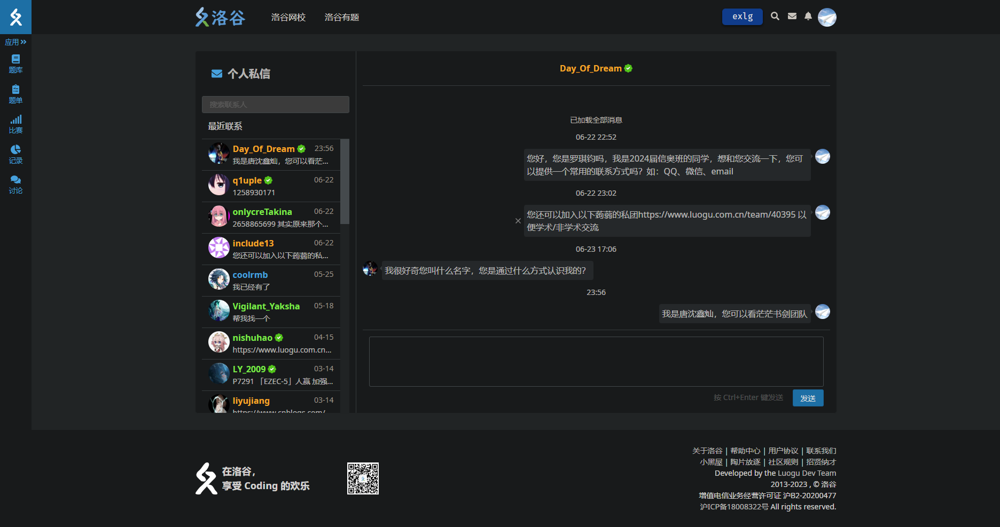

一夜之间就要离开了。


2023/7/1 0:18

# Day 3

又要回到可恶的yc了，什么破托管服务。

谢谢大家这么关心我，希望大家一起努力！

希望能在不远的将来重返OI。

事实上我并不为此感到焦虑，因为我认为这是我应得的，我还以为会因为whk直接把我踢出去。我觉得人生百年最幸运的事莫过于有后悔的余地能够去改变这一切。多么幸运啊，加油！

2023/7/2 10:55

刚打印了几道例题和一堆OI-WIKI的dp学习资料，在yc里做一做。

希望能把没学懂的dp学会。

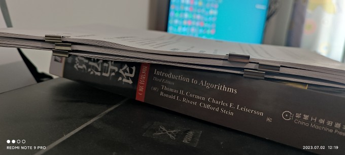

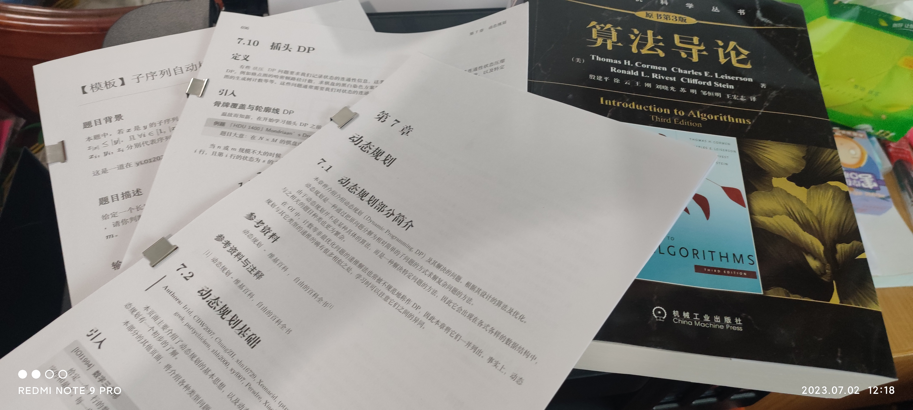

2023/7/2 11:54

# Day 15

想了许多，做了许多(也并不是很多)，今天是真正的暑假到来的前一天。心中好像有什么堵住了，想不到，写不出。那就写一写一些琐事罢。

学数论已有数日(读《算法导论》)，可是经常碰上一堆从未见过的符号与表达。这是从来没有在其他地方所会见到的景象:定理、推论、证明交织在一起，形成一个巨大的拆不开的线团，无从下手。于是我翻开了另一本"通俗易懂"的书《算法竞赛从入门到进阶》，如我所愿，没有了上述那恐怖的景象，但能帮助到我理解算法的就只有一句话:"......运行过程见《算法导论》......"除外就只剩下干巴巴的习题与几大段无用的介绍(如鲁迅所说"某将军的饭量"一样无用)。果然，我只得翻开《算法导论》的附录，开始艰难的学习。还好，上面的数学基础知识较为完整，于是我一句一句地钻研，一点一点地推导。在为数不多的课间中，我与飞舞的公式、错综复杂的关系做着斗争，一不小心就会迷失在其中。

虽说没能进入直升班，但我相信我只是换了一种方式在OI奋斗，我决定去参加csp2023，不知道教练会不会同意。总之，我相信一切都将会越来越好的！

2023/7/14 午

# Day 17

今天是个好日子！准备开始信奥的暑假计划！现在打进正在绵中上课的人的内部，然后开始偷师学艺awa。

最喜欢的音乐《献给我仅有的粉丝》，好听！

下一步就是追赶进度了，但是被拉了好远啊（

做了几个题单来赶进度

要赶得有：[平衡树](https://www.luogu.com.cn/training/339212)、[分块](https://www.luogu.com.cn/training/339215)、[扫描线](https://www.luogu.com.cn/training/339216)、[单调栈单调队列](https://www.luogu.com.cn/training/339217)、[多项式，FFT，NTT，分块，点分治，点分树，ODT，CDQ分治，线段树分治，后缀数组，后缀自动机，后缀树](https://www.luogu.com.cn/training/339218)。

任重而道远啊。

2023/7/17 21:05

# Day 20

怂鼠好可爱！！！银碳好帅！！！（堕落


2023/7/20 22:05

# Day 21

我希望待在信奥班，不是因为什么高大上的理由，什么我自命不凡啊之类，要解释清楚这一点还得讲讲我的经历。

其实我是用了点手段上的这个学校，之前在一个公立学校上小学，成绩也并不好，所以分班考试考进了最差的班级：大火箭可以这么说，班上有几乎一半的人都是不想学习的，整天混日子。有的甚至连高中都没得上。班上有52个同学，我这个成绩无论多差都能进前20，但班上能考进绵中的人只有4个。而在他们之后，就是一个巨大的鸿沟，第4名与第5名差了十几分。我们班已经非常厉害了，是同层次中所有项目都远超其它班的。无论是成绩、风气、班级荣誉。因此还拿了个优秀班集体（全年级一共10个）。我很庆幸，也很焦虑。因为我认识到班上几乎没有值得与我深交的人。而班上第一名我很欣赏，但我整天的去找她，她也对我感到厌烦了（因为没有，所以疯狂）。而在刚来到这个学校时更惨，我因为对新环境感到恐惧，我就竭尽全力去社交，以至于做了我今天都不能忘记的事：与寝室里的人搞黄色。我很喜欢一句话：“久入鱼肆而不闻其臭。” 很想要一个真心朋友，仅此而已。

我初一入学第一周没有上信息课（因为是星期一的课），而这节信息课刚好是要介绍信息奥赛的。班主任在星期五问了一下参加信息奥赛选拔的事，全班只有我一个人举手（我之前连这个名字都没听过）。凭借我的逻辑思维能力成功通过选拔。我在信奥班上结识了许多我所想接触的人，我很高兴以至于我在班上就变成了一个话痨，说个不停。“只有失去过才懂得珍惜”，所以我在信奥班上十分想发展人际关系，以至于我成了班上最热点的同学。我热爱这个群体，只因我失去过。但现在，我脱离了这个群体。“好好珍惜了却还是失去”。我为了上信奥我一直在想办法提升文化课，但依旧是跨越不了这个鸿沟。

就这么多吧，我要去学自由泳了，准备体育选考。

2023/7/21 12:30

谢谢大家的关心，我现在游泳回来了，现在在看很贵的学习资料。但是老想打开b站，唉。

需要的可以在线看，[课程](https://tsxce5-my.sharepoint.com/:f:/g/personal/nas_tsxce5_onmicrosoft_com/EgbdG8A8cpxCp6Mi4INCl9MBcUrIzp328wJivhyZaJV5bg?e=WbqFMq)，密码是`1145141919810`，几千的资料。挺值得的。

有需要网盘的可以找我要，免费的onedrive，1T空间。

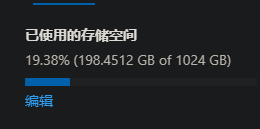

2023/7/21 17:25

# Day 22

今天去了绵中，很棒，和冯老师聊了两个小时，顺便参观了下绵中，拍了很多照片。图床挂不下这些照片，我就挂我的nas上了，[地址](http://4-6.tpddns.cn:5000/mo/sharing/GT7wGMtcR)，上不去可以用这个[地址](http://tsxc-home.dns.army:5000/mo/sharing/GT7wGMtcR)。

和冯老师聊了很多，最终我提炼出来一句话：`Just do it`

如此便好。

2023/7/22 20:48

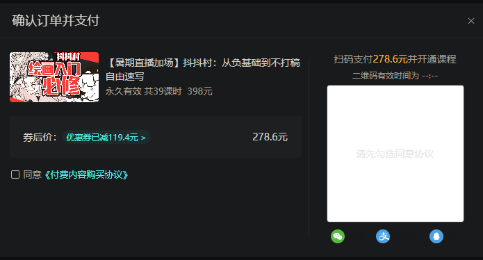

想学画画，但人的精力是有限的，但还是想学，但没有经济实力，但稍微有一点，但事情很多，但嫉妒其他画师，但负基础，但课程似乎很好，但没有自控力，但想通过这个增加，但下不去手，但想提升自己的果断，但有点肉疼。帮我出个主意罢QWQ。

2023/7/22 21:33

问了问，最后还是报了，肉疼。从没一次花过这么多钱（父母不知道）。

稍稍有点后悔，因为。。

这是原图：

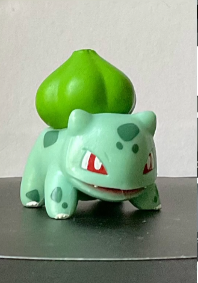

这是我画的：

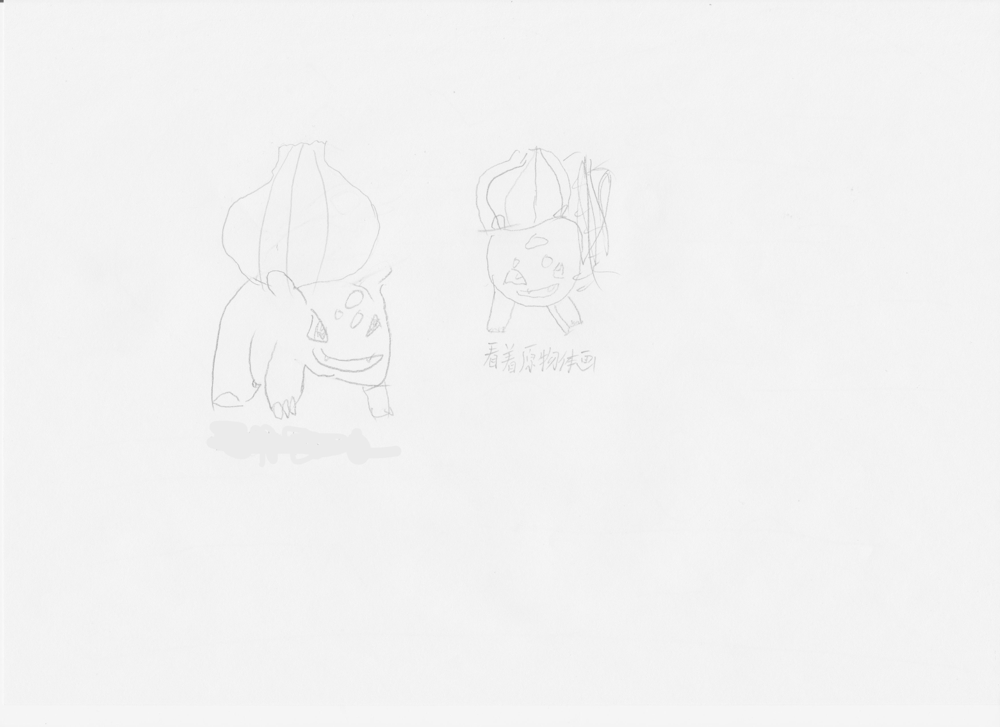

2023/7/22 23:33

# Day 23

>  欲买桂花同载酒  终不似  少年游

凌晨，我想了许多，看见顾宸溪发来的消息，差点泪奔。

```
顾宸溪 2023-07-22 23:16:14
唐老师，题单我会更新

唐沈鑫灿 2023-07-22 23:16:23
啊？

顾宸溪 2023-07-22 23:17:04
剪贴板中的题单会和我们同步

唐沈鑫灿 2023-07-22 23:17:41
啊，不必麻烦你了

顾宸溪 2023-07-22 23:17:47
加油

唐沈鑫灿 2023-07-22 23:18:06
我把题做完了会来找你的，到时候你一次弄完就行

唐沈鑫灿 2023-07-22 23:18:22
（我又不是24h翻看题单）

顾宸溪 2023-07-22 23:18:24
行，我们等你。
```

> 行，我们等你

从没想过还有人会关心我，从小到大从未有人主动给我发消息，给我帮助。写到这里，说不出来的哽咽。在床上翻来覆去，好几次攥紧了被子，把头埋进去，哭不出来，只是感觉暖心与激动。

> 只有失去过才懂得珍惜

这一次，我绝不会允许再次失去这一切，这是我的信念。

OI先放一放，我相信，只要能够渡过这个难关，OI也将指日可待。

我报绘画班也是我的梦想（我梦想还不少），也想通过这个学习的过程让自己能够坚持很多事情。我相信一句话（自己提炼的）“连音游都能练起来，其它的还难吗”。

其实昨天去找冯老师聊了很多很多，他对我的期望还是很高的，在谈话中提到了一件往事，差点哭出来，还好没被发现。

在初二下刚开学的时候，学校因为疫情，期末考试是在家里弄的。为了检验学生真实水平，组织了一次名校联考，当时我正处于迷茫期，知道要做什么，能做什么，想做什么。但没有行动，每天焦虑却无所事事，网课期间几乎醒着的时候都是玩游戏、看视频。我为了打破这个状态，弄了个类似直播的办法，录制下来了我晚自习的做作业过程（没几次是把作业完成的）。这里有一个[视频](http://4-6.tpddns.cn:8888/311.html)，可以去看。但依旧无法改变堕落的趋势。其实这个状态从初二上期就开始了，倒是有一些历史资料可以考究，因为学习dottle写鲜花，留下了很多日记可供参考。我在这里摘录几份看看我当时的精神状态（一字未改，包括任何标点，除同学名改为首字母。本来打算采用脚注标注注释内容，由于luogu博客不支持，换成了`这个`来标注）。

>2022/11/4 星期五
>
>~~论营养~~
>
>最近zc同学和我讨论起了关于营养的问题，我们从身体上的不适一直谈到自己每天要吃多少东西，我们都认为吃得多就长得多，毕竟我们自认为自己还算刻苦，每节体育课下来浑身无力，但成绩丝毫不见增长，我有点不知所措，但也无可奈何，虽然我对成绩也不如以前在乎了。
>
>今天的鲜花（还没想好叫什么，就先叫做鲜花好了）的内容似乎已和题目偏离了，没事，开心就好，把题目划掉继续写：
>
>现在是最后一节自习课，马上就要放假了，但还有一堆关没过，数学改错已经欠了几周了，英语默写单还未改完，甚至还要将被子带回教室叠`当时班主任实行因被子扣内务分就星期五拿去教室叠`，是在不知该如何是好了，就这样摆烂好了，先叠被子，然后去过关英语，杰哥（math teacher）`我们数学老师叫张杰`就敷衍几下`当时一般是 直接逃走/耗时间，那次是逃走`好了。
>
>但我有时也在想，我这是怎么了，物理清理已拖欠几周的了（甚至只写了第一周的），物理小提单少写了一张，导学案更是一点未写。数学不必多少，三天两头地不改错，有时也有几张未写，历史地理生物竟只写了几次，我这是怎么了？考试时竟也会摆烂，写个作文写一半直接开摆，语文卷上如同国画`喜欢读三体，可能是受这本书影响`，星星点点的留白散落一地，最终凝结成60分的一学月分数`没找到语文卷子，无从考究。`（满分120），我这是怎么了？我不知道，可能我得去找人帮我一把。
>
>下课了，今天的鲜花结束了，但生活仍要继续，我去敷衍老师了。

>2022/11/21 星期一
>
>在这一过去一半的初中生涯中，令我最印象深刻的事并非开学`指初一刚到yc`时的新奇`原来并不在yc读书`，也非最近老师的惩罚，甚至连考上信奥班也没有这件事特殊，难忘。这件事发生在一个平凡的，毫不起眼的一个星期四。
>
>那日下午，地理课上，李老师`地理老师`发现我的作业还未补好，于是就打算惩罚一下我。正好李老师刚好在第四节班会课要在22班补一节课。于是我和qzh `和我一样没写地理作业`一起到22班去了。李老师于是就开展了一次地理知识大赛，qzh选22班的人对战，22班的选人与我对战，最终qzh 1:2，我 0:2（有平局）输了比赛。但这次比赛给了我信心与勇气学好地理，于是从那之后，我的地理成绩就一直在上升`地生中考190，两科都是95`。
>
>因为有了正向激励，我就开始认真学习，然后得到成绩，又有了正向激励，又能够继续提升。我的物理也是一样，即便是一个新学科，但我一开始就成绩不错，得到了源源不断的正向激励，以至于我在假期只将物理作业写了。
>
>实际上我在11月4日`就是上面那篇`就意识到这个问题了，但我还是心存侥幸，认为我在半期能考好，就想到了半期之后再来解决这个问题，但半期考试过后我还是在逃避这个问题，只有在一个人独处只是，才能在日记中写下“我该如何是好？”“我怎么了？”这样的语句，但在写完之后，我从未行动过，一直在逃避问题，之后整个人变得麻木，日记中不再出现，深层的思考`下面将摘抄一点有关这一点的文章`，我只敢纵情享乐，将不好的会议深深地藏在心底，整个人如同行尸走肉，没有了思想。
>
>但现在回避不了问题，那就只有解决问题，从认真写作业开始，不断得到正向激励，只有在坠入深渊之后才明白光明的可贵，只有在登上巅峰之后才领略高处的自在。努力并非限制自由，而是在保护被你不失去自由，成功并非结束，而是为下次成功奠定基础！
>
>之前以为是信奥影响了我，但现在看来并非如此，信奥仅仅是占用了一个中午与一两节湾子蟹，而且除去信奥课之外，我很少用时间去思考有关信奥的事（除放假外），对我来说，信奥课如同一种调剂，在紧张的学习生活中让我得以放松，（初一刚开学没有信奥，当时学一周下来整个人都不好了）
>
>我现在努力一定还来的级，数学现在开始学代数了，两个不同板块，相互独立，我一定能学好`根据现在，确实`的：
>
>愿踏上未来之路走向光明之所在。
>
>真好，看来写完作业也并非难事。除了`这里戛然而止，无从考证了`
>
>记得去找生物老师，就说缺了一节生物课`如何缺的课已无从考证`，下午交导学案。（一定要快，wyjj`生物课代表`会和王老师`班主任`说`说我没交作业`）

> 2022/11/15 星期二
>
> 太冷力，（悲），太阳被撅力，做核酸时冷到打战。
>
> 奶多招风，今天被王老师`班主任`“打地主”了`牛奶被瓜分`。不就是奶稍稍多了点吗？（也就7个）QSWL`气死我了`。
>
> 今天在寝室喝了两个奶，感觉整个人都“升华”`什么叫升华已无从考证`了

总之，这就是我前期的状态。

> 2023/2/6 星期一 阴
>
> 6:40 起床
>
> 7:20 -- 7:50 早读
>
> 30min 大课间
>
> 12:45 午休
>
> 2:10 起床`这个时间可能记错了，应该是1:50`
>
> 2:17 到教室
>
> 今天是开学第一天，只有付出了才有收获「逆水行舟，不进则退」我可不能停下，加油冲冲冲！`日记里是这样的，但这只是鼓励自己的话。`

当时是刚初二下开学，班主任告诉我考不到A1就退信奥。

2023/7/23 午

刚去游泳了，三回啊三回，三节课就进入到练习自由泳整套动作的部分了。我真厉害awa。

言归正传，当班主任告诉我之后我很焦虑，同时也处在刚刚说的迷茫期，所以也是没有动力。但我通过晚上在寝室拿着一本特别难的练习册，和另一个数学特别好的同学一起做题，成功让两个人一起思考，能够高效地学习。一道题要做很久，但我依旧做了很多，当我今天翻开练习册时我都很震惊。

一首特别好听的歌[《献给我仅有的粉丝》](http://4-6.tpddns.cn:5678/blog/献给我仅有的粉丝.wav?preview)

可恶，不想写了，就这样吧

2023/7/23 18:54

# Day 25

更换了博客地址，用的自己的nas。

2023/7/25 23:30

# Day 26

不知为何，没有了激情去做任何事情，好吧，可能是我懈怠了。不过这几天找到了几个好听的歌，分享在这里。

无损的哟（luogu无法使用，建议去**[AFO-博客@tsxc](http://4-6.tpddns.cn:8888/344.html)**听歌）

《室内系的TrackMaker(YUNOMI)（翻自 nicamoq） - Hanser》（当前最爱） 

<audio src="http://4-6.tpddns.cn:7963/blog/uploads/%E5%AE%A4%E5%86%85%E7%B3%BB%E7%9A%84TrackMaker(YUNOMI)%EF%BC%88%E7%BF%BB%E8%87%AA%20nicamoq%EF%BC%89%20-%20Hanser.mp3"><audio>

《Unity - TheFatRat》

<audio src="http://4-6.tpddns.cn:7963/blog/uploads/Unity%20-%20TheFatRat.flac"></audio>

《Disco Panzer (feat. R5on11c) - Alan Aztec》

<audio src="http://4-6.tpddns.cn:7963/blog/uploads/Disco%20Panzer%20(feat.%20R5on11c)%20-%20Alan%20Aztec.mp3"><audio>

《献给我仅有的粉丝 - WOVOP》

<audio src="http://4-6.tpddns.cn:7963/blog/uploads/%E7%8C%AE%E7%BB%99%E6%88%91%E4%BB%85%E6%9C%89%E7%9A%84%E7%B2%89%E4%B8%9D%20-%20WOVOP.flac"><audio>

2023/7/26 11:47

[优秀的OIER是不学算法的 - 知乎 (zhihu.com)](https://zhuanlan.zhihu.com/p/32171371)

很有感触，不能说什么，或许我不适合OI。

2023/7/26 12:07

今天就不去游泳了吧，我决定停掉算法学习，去学习数论。至少是会锻炼思维的吧，希望如此。感觉很空虚，不知道做什么，数论令人望而却步，迎难而上也不是我的风格。我相信这一点：**时间与思考会告诉我最终的答案**。只要我思考动作，寻找最省力的方法，然后加以练习，就能够学会一项事物。无论是之前打phigros（现在rks12.00）还是现在学自由泳（现在练到自由泳组合了），都印证了这个观点。推而广之，我相信，没有什么是我做不到的（既然其他人都能做到，大家都是人）。加油！

2023/7/26 12:18

# Day 27

雨间歇地下，我在弄新的博客主题，结果又玩脱了（没有备份）

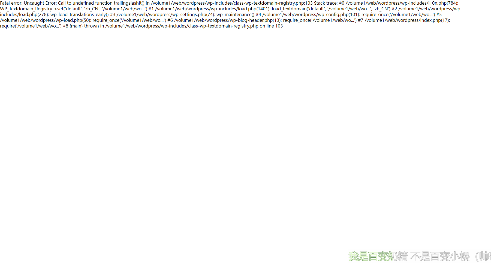

弄了一个下午，终于弄好了。

现在这个博客更换了主题，并删除了以前的文章，欢迎大家来我的博客写文章。免费注册。

之前的用户已全部删除，请用**真实邮箱**重新注册。之前的文章如果需要可以找我恢复。

没有邮箱的话我可以给你强制注册一个账号，私信我就行。

[博客@tsxc](http://4-6.tpddns.cn:8888/)

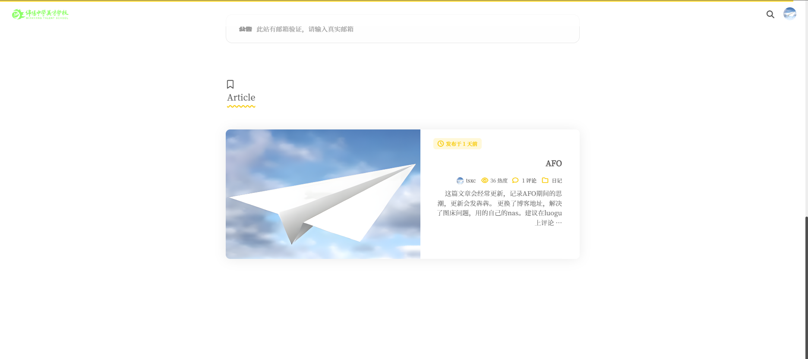

2023/7/27 17:34

# Day 30

昨天出发，今天早上在汶川转了一圈（新县城）。风景很好，但是我最喜欢的亮绿色却不是很多。天气也很好，太阳很大。在汶川给我最深刻印象的是两个字：精致。县城很小很小，窝在一个小小的山沟中。绿色很密很密，围在我的四面八方。我走到一个小区之中，周围是层层叠叠的植物，将我包裹。四面是此起彼伏的蝉鸣，将我笼罩。声音之大，从未见过。此地仅有不到一百平米，却造就了如此美丽的人间天堂。小小的精致的神奇的宝贵的美丽的童话般的令人向往的汶川啊，此地，即是我们的第一站。

2023/7/30 13:47

拿上了我的天文望远镜，打算用来看看风景，觉得星星只是贴图而已，很遥远。这望远镜用于地面观测效果也特别好，应当会拍几张照片。

2023/7/30 14:39

在路上堵车，堵了我一个小时。全用来打phigros了。现在rks有12.03了，高兴awa。好困。。。

2023/7/30 17:05

睡醒了一觉，太美丽啦红原。还有32公里到红原县城。

2023/7/30 19:09

不去县城了，就在这里找地方住。rks12.06了，涨得真快。

2023/7/30 19:44

我们的住宿坐标：
32°38'41.8800"N
102°19'48.7860"E

2023/7/30 19:48

# Day 31

昨天晚上看了个视频，一晚上没睡着。总结出了两点：
在过程中寻找快乐
降低快乐阈值
非常滴有用，强烈建议大家都用起来awa

2023/7/31 7:35
美美的吃了一顿，高兴。现在出发去若尔盖！

2023/7/31 8:44

# Day 32

今天被堵了，从4:15一直到7:33。中间只走了两公里。而我们还有200km才到今天的住宿地点。我也是无话可说。总之，祝我好运。

2023/8/1 7:35

# Day 37

> 青春是偷不走的，青春不是非要完成某些同质化的仪式，青春不是去旅行、蹦极、坐热气球，**青春的是我，我在这个年龄相遇的一切，都是青春**。
>
> ——[《电影院，你是有事吗》Zhan丨](https://www.bilibili.com/video/BV14R4y1F7am?vd_source=581cee4597c69fdf8e159c577e97a869)

2023/8/6 19:49

# Day 38

游泳+写《回忆录-上初三之前的回忆》，将会作为单独的文章发布，敬请期待。

写的时候翻资料翻到我们班唱歌，被感动了呜呜呜。

2023/8/7 17:47

# Day 39

看到一个视频，我终于找到了真正的救赎之法：备受关注。

2023/8/8 晚

# Day 40

可恶，眼镜在游泳馆的更衣室弄丢了，怀疑是有人拿走了（恼）。气孕！

2023/8/9 17:29

# Day 41

哭了，最初是哽咽，然后眼眶里慢慢被注入了眼泪，最后无力地滑落了下来。第一次为一个虚拟的世界而哭泣，或许，这并不是虚拟的吧。最想哭的时候还是那次在电影院看《烈火英雄》，看到在化学罐区前的消防官兵录视频和家人告别，但眼泪忍住了没有掉下来。

这或许是我见过的最平静的生活了吧，如同一股潺潺溪流，流过我的心，有着细碎的声音却平静。我会永远地记住的。再见

[《100天后就要删除的世界》(bilibili)](https://www.bilibili.com/video/BV1Fx4y197wp)

2023/8/10 22:25

更新了我的个性签名：人生最棒的东西 莫过于平静的生活 我们只是一个旁观者 享受它 即是你最大的福分 2023/8/10

2023/8/10 22:38

# Day 47

写了回忆录，马上就要开学了，让我们反思过去，向未来腾飞！

2023/8/16 12:58

# Day 52

现在打算考虑下如何在NOI Linux中调试，但是在网上找了半天也只找到两篇教程，包括一篇视频教程。不知道现在的OIer都这么勤快吗，都输出中间值。作为一个懒人，正在学习使用Code::Blocks。但Code::Blocks需要生成项目文件，很不适合我。所以我平常刷题应该会用CP Editor，特别舒服，强烈安利。里下次打CSP不远了，我应该加紧了。

2023/8/21 23:52

# Day 59

太高兴了！居然真有人读我的文章！从未想过从读者到作者的转变竟是因为1篇日记！今天在路上遇见了几位现在的OIer（与我这位AFO的 o i e r ）形成鲜明对比第一次，体验到了被线下催更的感受我脸都要笑烂了！托wzy的福，我应当会录一首歌（小心你的耳朵awa）有段时间没动笔写文章了。不过，我以后可能会天天写了罢（被催更的感觉真的很好！）。

写一写校内生活好了。今天下午，由于老师开会，所以是自习课。我们聪明的数学老师就让课代表给我们讲卷子。我前几天玩握力器，把左手干废了，现在一动，它就有点疼，大概是得了腱鞘炎。我的ppt讲的十分成功， 主要还是因为最后写的感悟又长又臭，班主任（语文老师）给予了高度评价，还说要好好去品读一下，感觉实践之星稳了。其实我并不想到最后会这样，我做的比较水，只是写了篇千字文而已，我会把文章挂上去，包括我的PPT及稿子。

我发现，我学绘画的最大阻力是自己的手劲小了（约40kg），所以，并不能拿稳笔。打音游也受此影响，底力不足。

之前有许多事，没有记下来，因为我写出来好像是给自己看的，但现在不同了。

我在考虑是否要换一个博客平台，换成静态博客然后挂到github上面。主要是万一哪天我的那台笔记本去世了，就不好了。（虽说有完整备份，但还是顶级麻烦）

好了，写到这里右手也疼了。

打算在每次发文之前写个互动话题作为一种催更方式。同时，让我知道大家有没有读我写的新东西awa。

现在我看到我写的文章就笑得合不拢嘴！，但我想到我还要把这篇文章一个一个字的打上去，想想都烦。（或许可以用用语音输入法？）

离中考还有287天！

我这篇文章写的好乱，将就看吧。我可能会发些文采稍好些的单品？在写了在写了

对了，我从清洁委员转职化学课代表了。

晚自习因化学老师要求，去一班找化学课代表发作业，在门边的一个同学将手伸过来，without any thinking，我立即将手向后缩了缩，顿时引起一阵笑声，事后回想，我一般不会这样，反倒会顺势递过去。但当时我要让他将卷子发了，并且还有要求要讲（指让同学改错）。我这什么多线程大脑啊，还没等我反应过来就已经分析完毕并且作出动作了！等到他表明自己也是化学课代表的时候我才对他讲起了要求。总结：玩phigros玩的，当课代表当的。

2023-8-28

# Day 60

废了九牛二虎之力，终于部署好了！！！

[tsxc的小站 (tsxc-github.github.io)](https://tsxc-github.github.io/)

2023-8-29 21:46

# Day 74

在机房快乐玩耍awa

2023-9-12 13:18

# Day 92

今天是一个好日子，我会唱首歌祸害一下大家的耳朵awa

2023-9-30 13:43

# Day 128

好久没有更新了，没啥时间把写了的打上去，游记也还在写（从比赛到现在一直都在写，应该会写几千字，毕竟是最后一次了）。希望大家能够多多评论，这样我好有更新的动力。

一直在弄群晖DSM7的更新，担心数据出问题，要弄全盘备份，但是又没有合适的存贮介质，很担心哪天这玩意去世了。硬盘好贵，买不起QWQ。

2023年11月5日12:49:22

给博客弄了评论通知和浏览量功能，真不错。顺便提一句，这个博客主题是她一个人做的，太牛啦。我现在正在学习，以便添加新的功能awa（开源万岁！）。

2023年11月5日14:21:33

# Day 135

在网上找了很久有关AFO的文章，可能只有我是因为whk才AFO的罢。听了有关AFO的很多歌，因为昨晚看见群里的人都在打AtCoder，而我却在家打着phigros、刷着b站。学习的重担压着我（或者反过来），周末是仅剩的休息时间。不知为何，我的学习能力这么强却无法搞定whk？无话可说。

想着近在咫尺的入团，向着我所信仰的一切去努力。像OI一样，入团是我的信仰。但仅有三个名额，能够吊打我的就有四位。我并不有什么胜算。虽然如此，我还是在给我的入团申请书打着草稿（我知道要被选为入团积极分子）。我不想去抄一份，这不仅仅是一份入团申请书，这是我所珍视的，我不想再留下遗憾。

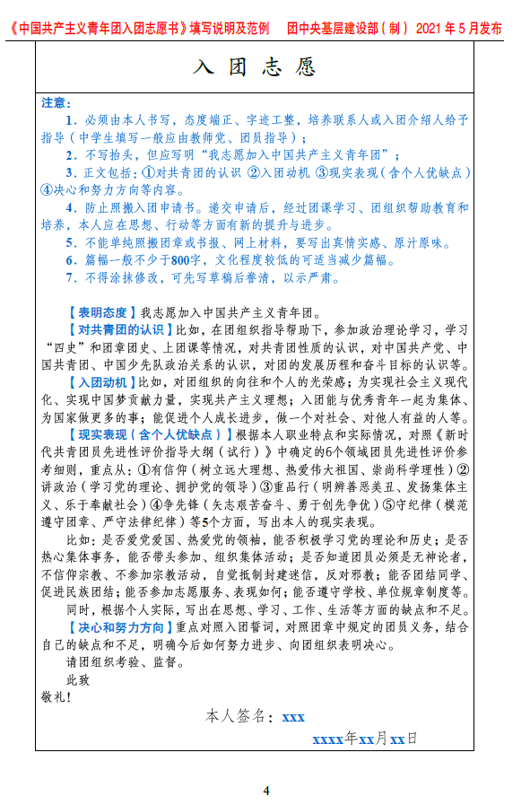

2023年11月12日14:53:24

# Day 139

快乐月假使我快乐，正在写博客代码。。。

2023年11月16日23:04:59

# Day 140

总算弄好了，可以用Twikoo评论乐！总算是找到一个轻量级的评论系统。

把图片改成了本地访问，这样子就不会因为Github图床恼人的速度而难受了！

2023年11月17日18:03:00

# Day 142

时间好快，又要上学了，感觉啥都没弄，作业动都没动，死了┏┛墓┗┓

2023年11月19日12:57:47

# Day 148

好诶！证书有了！绿钩有了！可惜不是蓝色的。

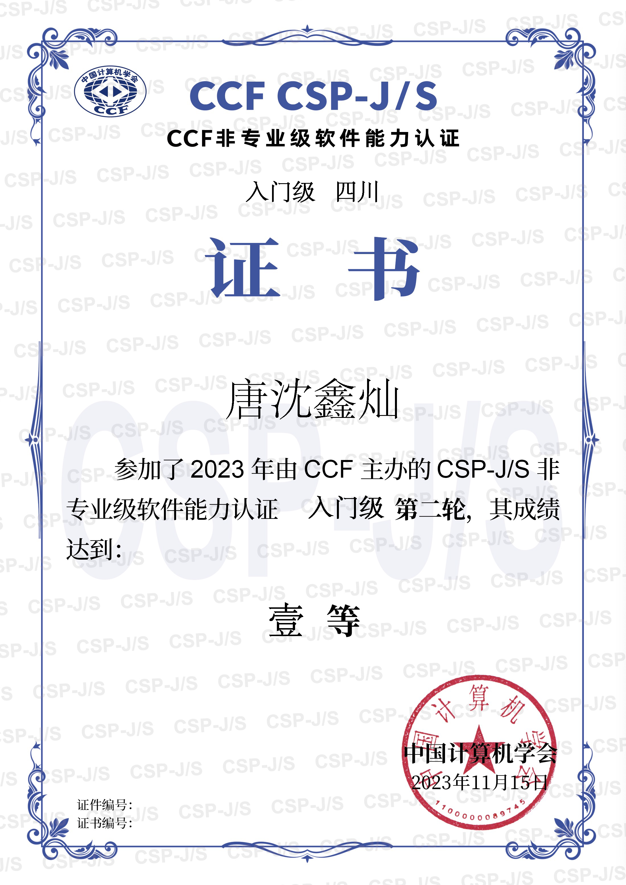

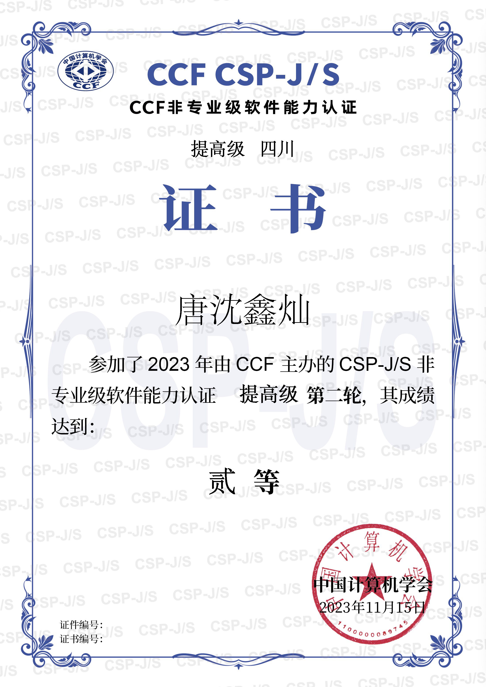

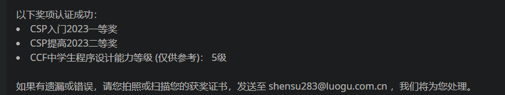

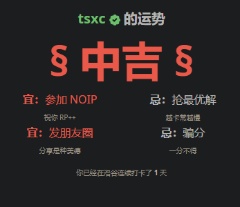
