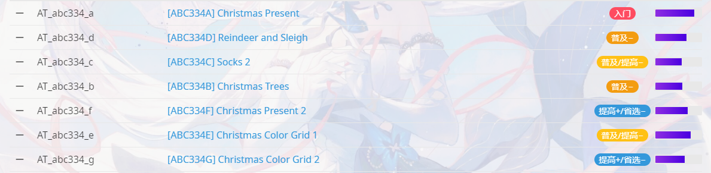
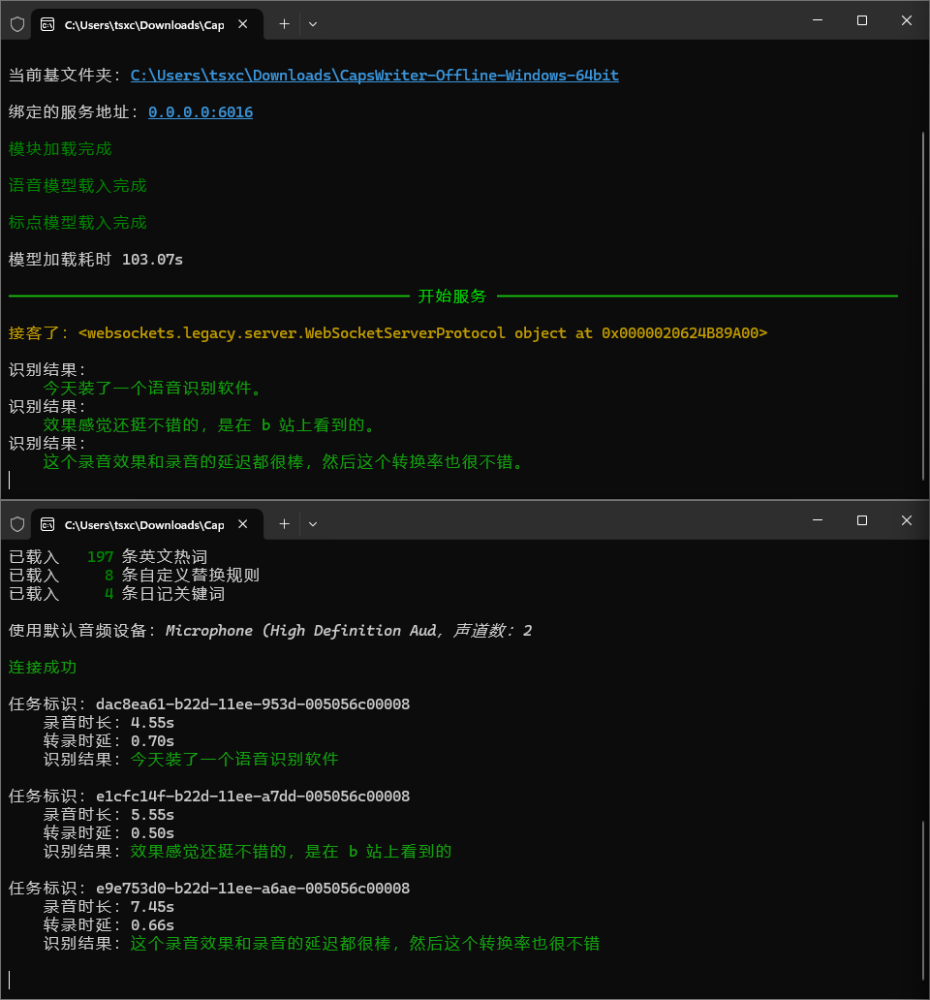

决定在家写日记就写在这里，加密的，方便看。

# 2023年

## 12月

### 31日

最后一天，今天晚上要去玩UNO。

删了很多QQ好友，决定要重新开始。

今天做了小小宇的一套题，发现OI能力下降了不止一星半点，很焦虑，决定要在学校学习OI。不然我很难（不可能罢）追上他们的。吕子轩给我提供了很多建议，古皓宇也是，我还去问了周蜀喬，这里总结一下

* 古皓宇：

> 在学校学OI找zp和班主任申请中午和初二的一起上课，找nxppm要课件自己看（这是我能想到的办法，也许你可以问lzx）
>
> at不要报了名不打，会掉分。每道题尽量确保正确再交，少吃罚时，多手摸样例找规律，很少有ds
>

* 吕子轩：

> 把笔记本带过来(我:班主任不支持此插件)这边建议重装班主任呢，或者去考7中
>
> 这个东西确实是要多写，暂时不是很清楚，拿笔和本子写
>
> (我:哪里能挤出来时间吗)就是现在(我:太牛啦，一语道破，但是如何战胜自身的惰性呢)你问对人了，现在每周六回去在打AT吗(我:一秒没碰)对了撒，如果有一定要打，而且要补，打完补或者第二天补，可以去看题解之类的
>
> AT一般是8点开始
>
> (我:AT难度对我有点高了把)没叫你打Phigros，打ABC(我:ABC大概是什么难度呢)基础难度你现在的水平，大概是前6道，总共7道(我:我NOI大纲里J组往上都不会了（没学+忘完）)不用高级算法，要人类智慧。这个难度，G多数时候有紫
>
> 
>
> (我:这个通过率我就放心了)不，这个是赛后提交的通过率（
>
> (我:CF能打吗)你要熬夜可以打，Div4没有营养，不过想AK还是可以打打。推荐Div3>Div2
>
> (我:有啥好用的资料吗)你觉得思维有资料吗，唯手熟尔(我:至少要点启发式的东西吧，一个人学实在艰难)你跟我的状态一样，但是OI确实要靠自学。你可以买高数自己看自己学，还是比较容易懂，而且后面会用到。我这里有几本，如果你要看的话可以找我借。
>
> (我:我先得练练题，不然我这个还会下降)对的，从AT开始
>

* 周蜀喬：

> (我:有啥办法能在学校学OI吗（正课一点不落，还得抽时间背东西）)那你就写完作业想想题(我:但是没有设备诶)可以先记在脑子里
>
> (我:如何战胜自己的惰性呢)玩多了就不想玩了(我:可惜我没有这个烦恼)

2023年12月31日18:15:06

气死力，找不到我以前的历史书了，很乱就是了。不过我也不指望能找到awa

2023年12月31日19:36:04

# 2024年

## 1月

### 13日

今天装了一个语音识别软件，效果感觉还挺不错的，是在 b 站上看到的。这个录音效果和录音的延迟都很棒，然后这个转换率也很不错。

还是非常的好用啊

决定以后就用它来作为一个语音识别软件来写一些东西。实在是很方便啊。

刚说了这么多话，就没有一个错误的字。

2024年1月14日00:15:39

还是早点睡好了。

2024年1月14日01:09:29
