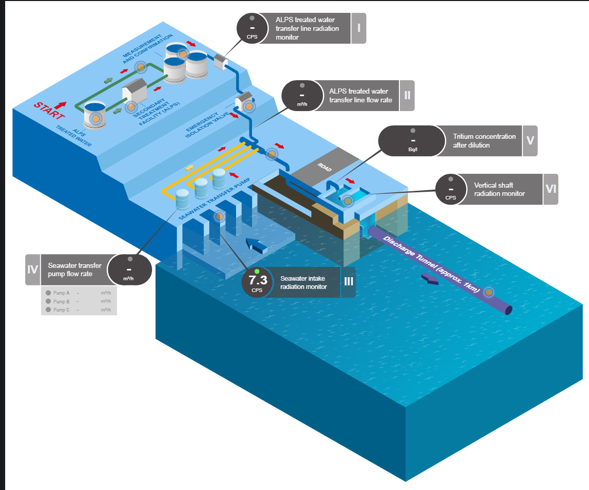

# 福岛第一核电站事故

**福岛第一核电站事故**是2011年3月11日在日本福岛第一核电站发生的核事故，由日本东北地方太平洋近海地震和伴随而来的海啸所引发。这次事故在国际核事件分级表（INES）中被分类为最严重的7级，与切尔诺贝利核事故同级，是目前仅有的两个7级事故。

## 起因

### 东北地方太平洋地震

**东北地方太平洋近海地震**是指2011年3月11日星期五于当地时间在下午2点46分发生震级为9.0的地震。引发最大爬高40.1米的巨大海啸。这场地震是日本有观测纪录到以来第一个震级超过9的地震，引发的巨大海啸也最为严重，更引发了一系列灾害（包括福岛核灾），导致了大规模的地方机能瘫痪和经济活动停止，在东北地区，部分城市更遭受毁灭性破坏。是日本本土自二战（结束后）迄今最严重的自然灾害。

### 福岛第一核电站

地震发生约50分钟之后，最高高度约为14米~15米（电脑分析后得出的高度为13.1米）的海啸袭击了核电站，设置在地下室的应急柴油发电机因淹没在水中而停止运作。此外，电器、水泵、燃料罐、紧急电池等大部分设备受损或被水冲走，核电站陷入了**全厂停电**（Station Blackout，缩写：SBO）。因此，水泵无法运行，不能继续向堆芯和乏燃料池注入冷却水，也就不能带走核燃料的热量。由于核燃料在停堆后仍然会产生巨大的衰变热，如果不继续注水，堆芯内就会开始空烧。最终，核燃料会因自身放热而熔化。

事故中的一系列事件在周围环境中泄漏了大量放射性物质，包括排气泄压操作、氢气爆炸、安全壳破损、管道蒸汽泄漏、冷却水泄漏等。1-3号机相继发生堆芯熔毁，1、3、4号机发生氢气爆炸，使得这起事故成为了前所未有的特大核事故。

一般来讲，核电站里会有几个核电机组，核电机组是由核反应堆、汽轮发电机、还有维持核核反应堆与汽轮发电机正常运行和保证安全所需的基本发电单元组成的。核电机组的发电原理，是利用核反应堆产生源源不断的热能来加热水，把水变成高温高压的水蒸汽，这些水蒸汽具有相当强大的能量，可以推动汽轮发电机旋转，进而发电。

由于核反应堆在衰变阶段依然有大量热量释放，这些热量如果没能被及时冷却，就会造成内部温度急剧升高，超过核反应堆外壳设计的承压能力，最后导致爆炸。因此，核反应堆在衰变阶段产生的热量，需要有台水泵维持冷却水循环，让冷却水不断经过核反应堆，时刻带走核反应堆释放的热量。

然而，在海啸发生后，福岛核电站失去了外部电网的供电。在正常情况下，福岛核电站的应急柴油机会启动，来给水泵和其他一些重要设备供电，维持冷却水的循环。但是，由于海啸威力过大，导致应急柴油机也失效了，无法为水泵供电，冷却水也就失去了循环的能力。在这种情况下，核反应堆过热，进而造成了堆芯熔毁，从而引发具有放射性的物质外泄，导致了核泄漏。在核泄漏的同时，由于核反应堆的锆金属外壳在高温下与水作用，产生了大量氢气，随后也引发了一系列的氢气爆炸。

当时，在面临即将发生堆芯熔毁时，便有工程师提出用海水冷却反应堆的方案，然而这么做却会导致核反应堆全部报废，因此东电公司并没有采取，反而是先将通风阀打开，将核废气直接排入大气中，妄图保住核反应堆。直到20个小时之后，福岛核电站的核电机组相继发生爆炸，东电公司才被迫采用海水冷却降温。

福岛核电站的核污水主要来源于两部分，一是在福岛核事故后，需要源源不断地注入冷却水，用以冷却仍在释放衰变余热的堆芯；二是由于事故导致反应堆破损、大量放射性物质泄漏到核反应堆外，进一步污染周边区域，而由于福岛核电站地势的原因，很多地下水和雨水一直源源不断地往福岛核电站区域冲刷进去，导致这些核污水的量越来越多。

在2014年时，福岛核电站每天都会增加500多吨核污水，在经过净化处理循环利用之后，每天依然会增加150吨核污水。为了储放这些核污水，截至2020年9月，东京电力公司在核电站厂区内建设了1044座储水罐，储水量达到123万多吨，而储水罐的总储水能力上限约为137万吨。这意味着，到了2022年9月，污水储存罐容量即将达到上限，核污水将无处储存。

# 核废水排放影响

如果将核污水排入海洋，海洋里的生物不可避免地会吸收排放的核污水，核污水中的放射性物质经过生物富集，可能会通过食物链进入人体内并累积。

经过多方考证，翻阅了联合国（UN）、国际原子能机构（IAEA）、维基百科的各项参考资料、中国外交部官方新闻，得到了以下内容。

2023-10-4 13:24，在国际原子能机构提供的实时监测数据中，仅有Seawater intake radiation monitor（安装在海水取水泵处的辐射探测器）处于监测且正常状态

8月24日处理后的水开始排放后，日本还请求国际原子能机构协助监测海水。原子能机构的独立采样和监测已证实排放水中的氚含量低于日本的运行极限，并表示原子能机构将继续监测海水。

在查阅了IAEA发布的日本福岛核污染水处置综合评估报告后，分析得到：在正常操作下，经 ALPS 处理过的水排放到海洋中的量可以忽略不计。 $ ^3H, ^{14} C , ^{129}I $​ 这几种放射性物质的排放量甚至远低于自然生成量。

IAEA的结论是

- 东京电力已根据国际安全标准对 ALPS 处理水的排放进行了 REIA。
- 综合考虑各种情况对公众所受的辐射剂量进行了评估，并对海洋动植物正常运行时
- 对动植物的放射性影响评价结果也得到证实
- 在正常操作下，经 ALPS 处理过的水排放到海洋中的量可以忽略不计。
- 辐射环境影响评价结果显示，预计对邻国人口造成的剂量可以忽略不计。
- 东京电力公司的海洋扩散模型预测氚和其他放射性核素的浓度非常微不足道，这些浓度与建模模拟区域边界的背景水平无法检测或无法区分。

中国外交部发言人表示对日本福岛核污染水处置综合评估报告可信度的质疑，指出“机构因授权所限，没有审查日方排海方案的正当合法性，没有评估日方净化装置的长期有效性，没有确证日核污染水数据的真实准确性”
